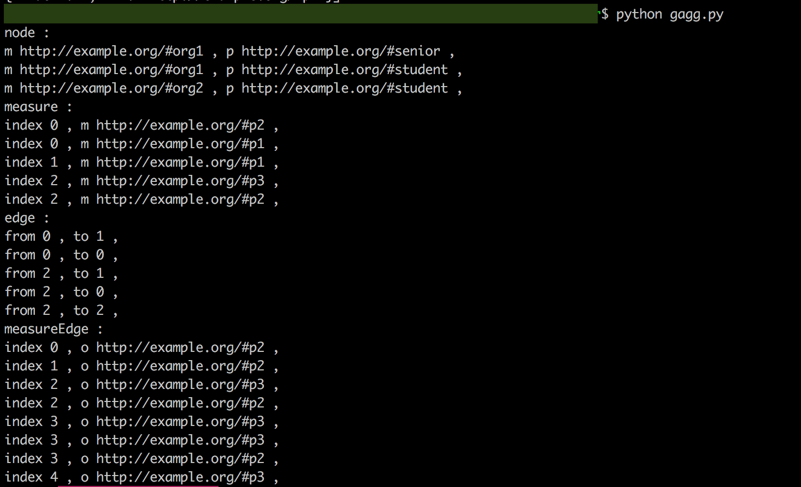

reproduceGagg
----

You can get a grouped graph of example in the paper "Gagg: A Graph Aggregation Operator".

## Description
* gagg.py - create Grouped Graph over the RDF graph, "paper.ttl".
* paper.ttl - the graph using for example in the paper.
## Demo

## Requirement
* Download Apache Jena Fuseki from "http://central.maven.org/maven2/org/apache/jena/jena-fuseki1/".
## Usage
1. Open terminal and run the command "git clone git@github.com:MiraiNiki/reproduceGagg.git".
2. Load paper.ttl on your local fuseki server.
3. Run the command "python gagg.py".